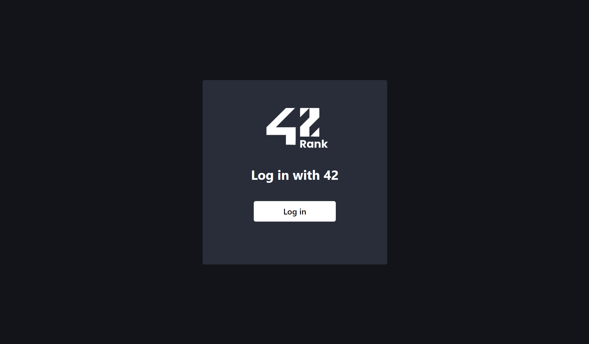
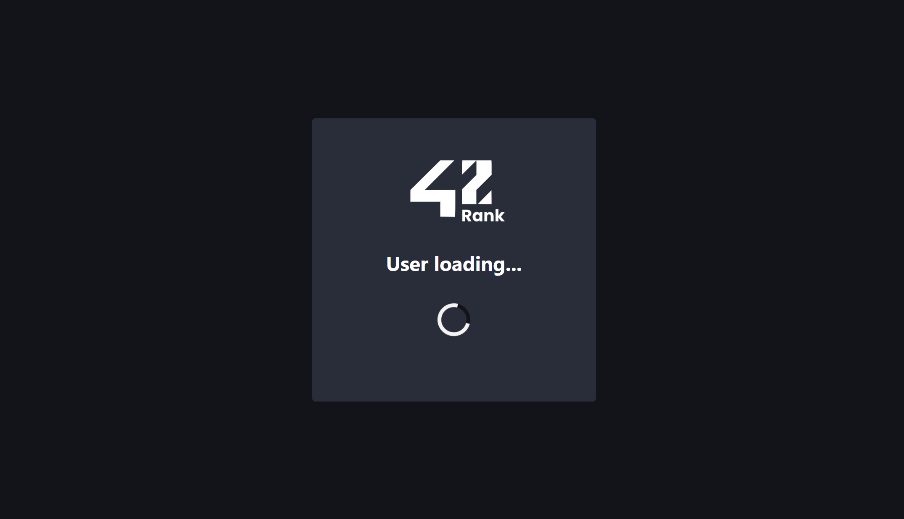
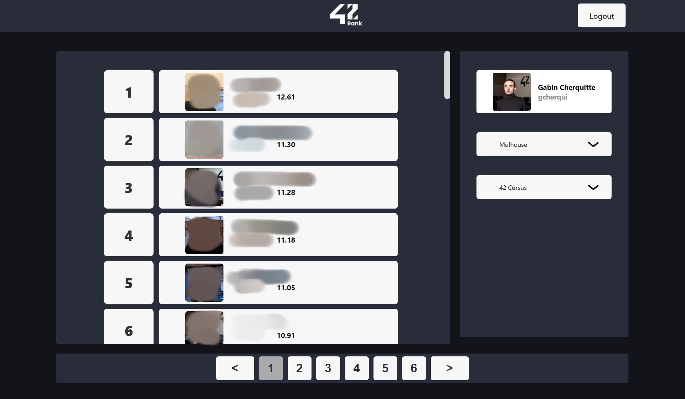
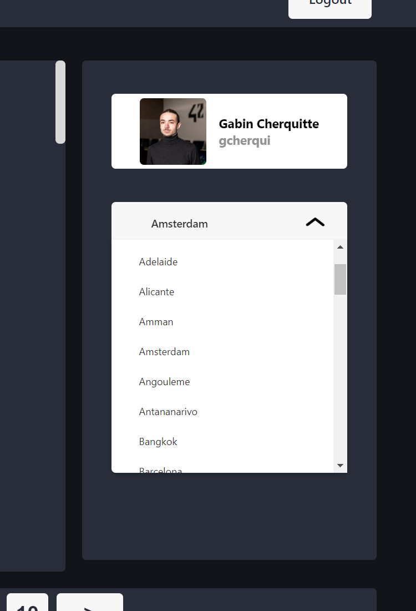

# 42Rank.xyz

 

This involves setting up a platform aiming to list all students from School 42 globally, using the school's intranet API.

 

The ultimate goal is to create a ranking of the best students.

Here are the details of the different project stages:

 

### Use of the Intranet API:

 

The School 42 intranet API is used to gather information about all students. This may include details such as name, surname, scores, completed projects, etc.

 

### Front-end with React-JS:

 

Front-end development is carried out using React-JS, a popular JavaScript library for building user interfaces. This allows for the creation of an interactive and responsive web application.

 

### Responsive layout with Vanilla CSS:

 

The user interface layout is made responsive using Vanilla CSS, meaning without the use of frameworks such as Bootstrap. This provides complete customization of the design.

 

### Back-end with Node-JS and serverless functions:

 

The back-end of the platform is set up using Node-JS. Additionally, serverless functions are employed, meaning the code is executed on-demand in response to specific events without the need for permanent servers.

 

### Use of Prisma with PostgreSQL:

 

Prisma, a database access tool, is used in conjunction with a PostgreSQL database. This facilitates the management and interaction with the database, providing a type-safe interface for data queries and mutations.

 

### Integration of Axios for API requests:

 

Axios, a popular JavaScript library, is integrated to facilitate API requests between the front-end and back-end. This enables efficient communication between different parts of the application.

 

### Creation of the mockup with Figma:

 

The site's mockup is created using Figma, a collaborative user interface design platform. Figma makes it easy to visualize and communicate the design before implementation.

 

In summary, this project combines modern front-end and back-end technologies to create a global platform listing School 42 students, with a particular focus on user interface responsiveness, the use of serverless functions, and effective data management with Prisma and PostgreSQL.

 

Login Page

 

Loading Page

 

Students Ranking

 

Campus Selection

